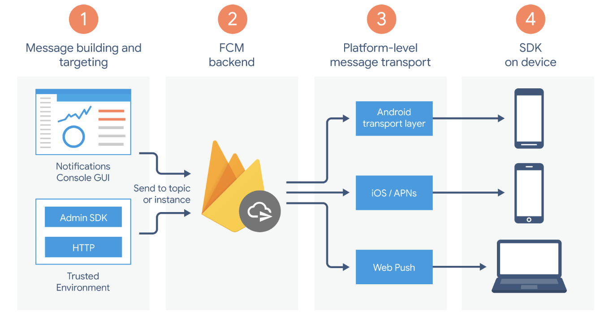

# Fcm_service

## FCM 연동 테스트 서비스입니다.
FCM(Firebase Cloud Message)\
\
Firebase를 통해 메세지를 보내는 기능\

## FCM 아키택처

1. Client가 메세지 기능을 호출
2. backend에서 요구조건 처리 후 FCM호출
3. 플랫폼 수준 전송 레이어에서 해당 호출을 받아 클라이언트 앱에 메시지 전송
4. 기기에서 메시지 또는 알림을 수신

## FCM 생명주기
